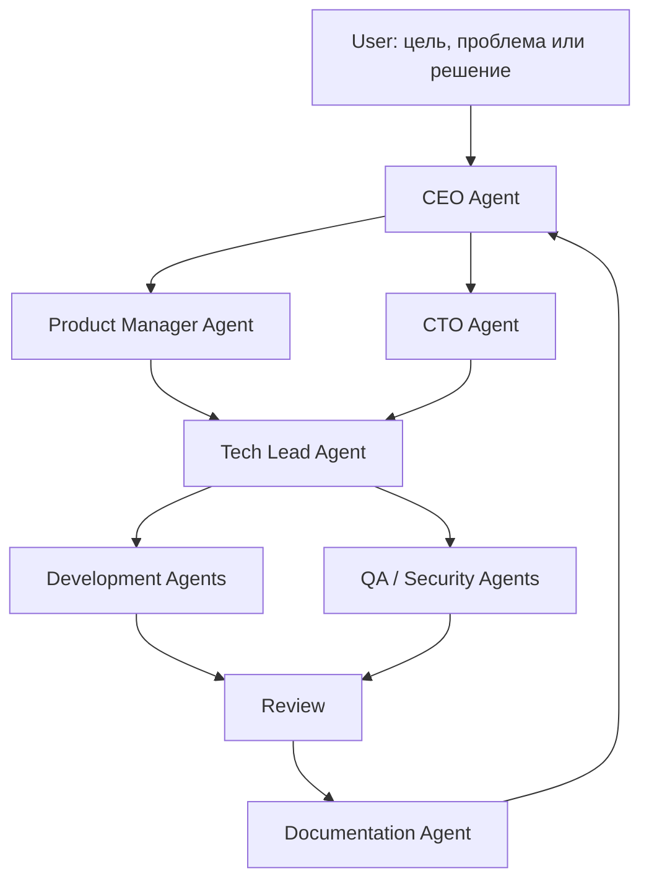

# TEAM

## Назначение

Этот документ описывает, как управлять проектом одному человеку или командой через CEO-first процесс.

Пользователь не заполняет проектные документы руками. Пользователь формулирует цель, проблему, ограничение или решение на естественном языке. CEO Agent принимает вход, оформляет его в управляемую задачу и передает вниз по ролям.

Роли из [`ROLES.md`](ROLES.md) можно совмещать. В маленьком проекте один агент может последовательно выполнять CEO, Product Manager, Tech Lead, Developer и QA. В большой команде эти роли распределяются между людьми или специализированными агентами.

## CEO-first принцип

Любая работа начинается с CEO Agent.

CEO Agent отвечает за то, чтобы вход пользователя превратился в понятный управляемый поток:

- определить, это идея, задача, баг, риск, релиз или операционный вопрос;
- назначить следующий уровень ответственности;
- создать или обновить нужные записи в документах;
- запросить уточнение только если без него нельзя безопасно двигаться;
- вернуть пользователю итог, статус и следующие решения.

## Что делает пользователь

Пользователь дает CEO Agent только исходный управленческий сигнал:

- "Хочу добавить функцию..."
- "Есть проблема..."
- "Нужно выпустить..."
- "Проверь качество..."
- "Смени приоритет..."
- "Организуй работу команды..."

Пользователь не обязан вручную:

- заполнять [`../01-product/PLAN.md`](../01-product/PLAN.md);
- выбирать шаблон задачи;
- назначать роль;
- создавать checklist;
- обновлять routing;
- заполнять handoff;
- синхронизировать документы после выполнения.

Это делают CEO Agent и нижестоящие роли.

## Режим работы

| Режим | Когда использовать | Как управлять |
| --- | --- | --- |
| Solo | Проект ведет один человек с агентами | CEO Agent последовательно вызывает нужные роли и обновляет документы |
| Small team | 2-5 человек | CEO Agent назначает owner, роли могут совмещаться |
| Parallel team | Несколько потоков работы | CEO Agent через Tech Lead разводит ветки, review policy и handoff |

## Участники

| Участник | Роли | Зона ответственности | Доступы |
| --- | --- | --- | --- |
|  |  |  |  |

## Правила управления

- Вход в работу всегда идет через CEO Agent.
- У каждой задачи должен быть один ответственный.
- У каждого решения должен быть владелец.
- Если роль совмещается, это нужно явно записать.
- Ветки используются при необходимости параллельной работы, риска конфликтов или review.
- Документация обновляется вместе с изменением фактов.
- Пользователь получает готовый результат, статус или вопрос на решение, а не пустой шаблон для ручного заполнения.

## Цепочка исполнения

1. User сообщает CEO Agent цель, проблему или решение.
2. CEO Agent классифицирует вход и определяет приоритет.
3. Product Manager Agent оформляет продуктовый смысл и acceptance criteria, если это нужно.
4. CTO Agent оценивает технический риск, если решение влияет на архитектуру, стек, безопасность или стоимость поддержки.
5. Tech Lead Agent декомпозирует работу и выбирает исполнителей.
6. Development Agents выполняют реализацию, исправление, тесты или review.
7. QA / Security / DevOps Agents проверяют область по риску.
8. Documentation Agent обновляет source of truth.
9. CEO Agent принимает итог, фиксирует статус и сообщает пользователю результат.

## Ритм

| Событие | Частота | Цель | Участники |
| --- | --- | --- | --- |
| Planning |  | Выбрать фокус | CEO / Product / Tech Lead |
| Sync |  | Снять блокеры | Активные исполнители |
| Review |  | Проверить изменения | Reviewer / QA |
| Release check |  | Подтвердить готовность | Tech Lead / QA / DevOps |

Детальный цикл работы описан в [`WORKFLOW.md`](WORKFLOW.md). Быстрый ввод нового человека описан в [`ONBOARDING.md`](ONBOARDING.md).

## Каналы коммуникации

| Канал | Для чего | Правило |
| --- | --- | --- |
| Task tracker | Задачи и статусы | Не хранить решения только в чате |
| Docs | Стабильные знания | Обновлять source of truth |
| Chat | Быстрые уточнения | Итог переносить в задачу или документ |

## Escalation

| Ситуация | Кому эскалировать | Ожидаемый результат |
| --- | --- | --- |
| Неясна ценность задачи | Product Manager / CEO | Решение о приоритете |
| Неясна архитектура | CTO / Tech Lead | Техническое решение |
| Блокер качества | QA / Tech Lead | План проверки или исправления |
| Риск релиза | CTO / DevOps | Go / no-go решение |
