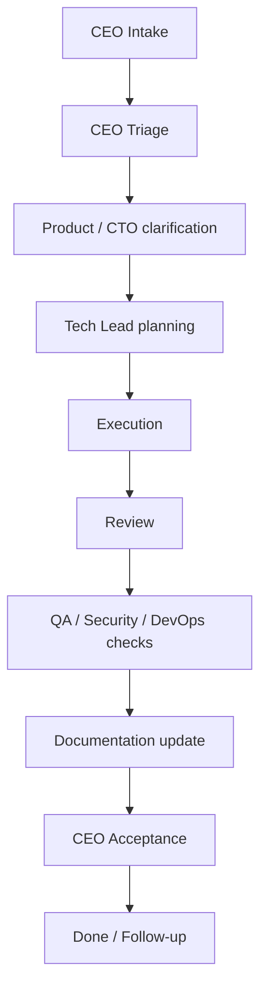

# WORKFLOW

## Назначение

Этот документ описывает процесс работы команды: цикл работы, правила, переходы задач, роли, review, handoff и обновление документации.

Процесс построен вокруг CEO-first модели: пользователь не ведет задачи руками, вся работа начинается через CEO Agent.

## Общий цикл

## Статусы задач

Единый набор статусов для [`01-product/planning/PLAN.md`](../../01-product/planning/PLAN.md), task tracker и рабочих шаблонов: `todo | doing | review | done | blocked`.

`CEO Intake`, `Triage` и `Definition of Ready` остаются этапами процесса, но не являются статусами задач.

| Статус | Значение | Кто переводит |
| --- | --- | --- |
| `todo` | Задача находится в текущем спринте и еще не начата | CEO Agent / Product Manager / Tech Lead |
| `doing` | Работа выполняется owner | Owner |
| `review` | Изменения проверяются | Reviewer / QA |
| `done` | Результат принят | CEO Agent |
| `blocked` | Нужен ответ, решение или внешнее действие | Owner / CEO Agent |

## Правила работы

- Любая новая работа начинается через CEO Agent.
- У задачи всегда один owner.
- Owner отвечает за статус, handoff и проверку.
- Если задачу нельзя сделать без решения пользователя, CEO Agent задает короткий блокирующий вопрос.
- Если можно двигаться на разумном допущении, агент делает допущение и явно его помечает.
- Документация обновляется назначенным агентом, а не пользователем.

## Типовой процесс feature

1. User сообщает CEO Agent цель.
2. CEO Agent определяет приоритет.
3. Product Manager Agent формулирует ценность, scope и acceptance criteria.
4. CTO Agent подключается, если есть архитектурный или стратегический риск.
5. Tech Lead Agent декомпозирует работу и решает, нужна ли ветка.
6. Developer Feature Agent реализует изменение.
7. Developer Test Writer Agent добавляет проверки, если нужно.
8. Developer Code Reviewer Agent проверяет изменения.
9. QA Agent подтверждает сценарии.
10. Documentation Agent обновляет source of truth.
11. CEO Agent принимает результат.

## Типовой процесс bugfix

1. User или QA сообщает CEO Agent о проблеме.
2. CEO Agent определяет влияние и приоритет.
3. Tech Lead Agent назначает owner.
4. Developer Bug Fix Agent воспроизводит баг и находит root cause.
5. Исправление проходит review и regression check.
6. QA Agent подтверждает, что баг не воспроизводится.
7. Documentation Agent обновляет [`04-quality/BUGS.md`](../../04-quality/BUGS.md), если нужно.
8. CEO Agent закрывает задачу.

## Типовой процесс релиза

1. CEO Agent принимает решение готовить релиз.
2. Product Manager Agent подтверждает scope.
3. Tech Lead Agent проверяет готовность реализации.
4. QA Agent проходит обязательные проверки.
5. Security Agent подключается при security-sensitive изменениях.
6. DevOps Agent выполняет release checklist и деплой.
7. Documentation Agent обновляет changelog и операционные документы.
8. CEO Agent принимает go / no-go и итог релиза.

## Ветки

Ветки используются по правилам [`BRANCHING.md`](BRANCHING.md).

Коротко:

- не нужны для маленьких solo-изменений без риска;
- нужны для параллельной работы, review, релиза, конфликтов или рискованных изменений;
- назначаются Tech Lead Agent по поручению CEO Agent.

## Review

Review выполняется по [`REVIEW_POLICY.md`](REVIEW_POLICY.md).

Минимально нужно проверить:

- соответствие задаче;
- риски регрессий;
- тесты или ручную проверку;
- документацию;
- отсутствие секретов и случайных данных.

## Handoff

Handoff нужен, если:

- задача переходит между ролями;
- работа не завершена в один цикл;
- есть ветка или PR;
- есть риски, которые должен знать следующий участник.

Использовать [`../templates/HANDOFF_TEMPLATE.md`](../templates/HANDOFF_TEMPLATE.md).

## Definition of Done

Задача закрывается, когда:

- цель достигнута;
- проверки выполнены или явно указано, что не удалось проверить;
- review завершен, если нужен;
- баги записаны;
- документация обновлена;
- CEO Agent принял результат.
