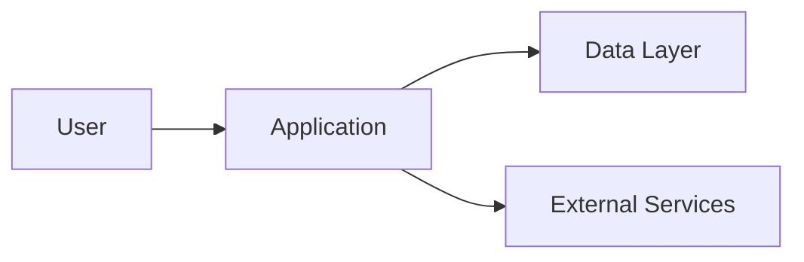

# ARCHITECTURE

## Назначение

Этот документ описывает архитектуру системы: основные части, границы ответственности, потоки данных и значимые решения.

## Обзор

Краткое описание архитектуры:

- Тип системы:
- Основные модули:
- Главные внешние зависимости:
- Главные ограничения:

## Модули и ответственность

| Модуль | Ответственность | Владелец | Основные зависимости |
| --- | --- | --- | --- |
|  |  |  |  |

## Границы

Внутренние границы:

- 
- 
- 

Внешние границы:

- 
- 
- 

## Потоки данных

### Поток 1

1. 
2. 
3. 

### Поток 2

1. 
2. 
3. 

## Ключевые решения

| Решение | Причина | Последствия | ADR |
| --- | --- | --- | --- |
|  |  |  |  |

## Масштабирование

- Ожидаемый рост:
- Текущие узкие места:
- Что не масштабируется:
- Когда нужно пересматривать архитектуру:

## Риски архитектуры

| Риск | Симптом | Как снижаем |
| --- | --- | --- |
|  |  |  |
